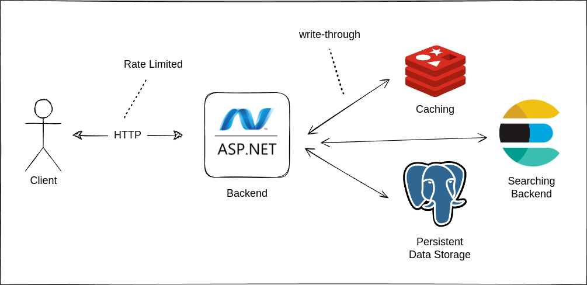

# Hello .NET
> [!NOTE]
> There is maybe some or much of unusual code that i written here, it is
> intentional as it is my very first time i write C#. The goals are to improve it
> time by time i keep exposing myself with C# ecosystem. Feel free to
> review my code and submit any issue for suggestions 😉

## Goals
The goals of this project is not really trying to solve a real-world problem
scenario, but rather to getting my hand dirty with .NET ecosystem nitty-gritty.
Below are goals that i set to achieve while building this project:

- [x] Learn about ASP.NET
- [x] Understand dependency injection in ASP.NET
- [x] Clean Architecture in ASP.NET
- [x] Use ASP.NET Swagger Generator => I changed it to use Scalar instead
- [x] API Versioning
- [x] Explore about Options Pattern
- [x] Implement Rate Limiting
- [x] Instrumentation through logging
- [x] Demonstrate N+1 problem solution
- [x] Demonstrate ACID
- [x] Implement server side caching with Redis
- [ ] Implement full-text search with ElasticSearch
- [ ] Implement unit & load testing

## System API Specification
API Specification are accessible in the form of OpenAPI specification that is
accessible in a form of Web UI in `/scalar/v1` when
you run the app. To run the application you can use the command below:
```bash
dotnet run
```

## System Design

